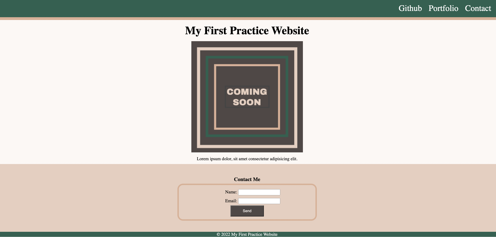

# My First Landing Page

<h1 align="center">
   
  
</h1>

<h4 align="center">Landing Page</h4>

  <a href="#About">About</a> •
  <a href="#license">License</a>

## About

This is a mini project to practice HTML and CSS basics such as the box-model, selectors and positioning. This is my attempt at recreating a simple landing page from scratch. 

## License

MIT

---

> GitHub [@bravlis2](https://github.com/bralvis2) &nbsp;&middot;&nbsp;

